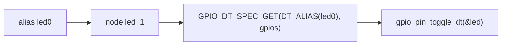

# Buttons & LEDs

A button and an LED are the smallest piece of hardware you can control, and they teach the pattern every Zephyr driver uses: find the hardware in the **devicetree**, get a handle to it in C, check it's ready, then call the API. You'll use two samples that ship with Zephyr itself — **Blinky** and **Button**. The course keeps a copy of each in `zephyr/samples/efz_samples/02_basic/`, next to every other sample in this section, and they run unchanged on the EFZ.

## By the end of this lesson you can

- Find a board's LEDs and buttons in its devicetree, and name them through aliases.
- Blink an LED through the GPIO API.
- Read buttons through Zephyr's input subsystem, and tell them apart by their key codes.

<LessonMeta time="about 40 minutes" need="the EFZ: LED1, LED2, BN1, BN2, BOOT" before="Meet the EFZ-ESP32S3" beforeHref="./efz-esp32s3-board" />

<br/>

---

## A first look at the devicetree

Your code never says "GPIO46". The board's **devicetree** file describes what's soldered where, and your code asks for it by name. Here is the part of the EFZ board file (`boards/embeddedfun/efz_esp32s3/efz_esp32s3_procpu.dts`) that describes the LEDs and buttons:

```dts
/ {
	aliases {
		led0 = &led1;          /* "the first LED"    -> the node labelled led1 */
		sw0 = &button_bn1;     /* "the first button" -> BN1 */
	};

	leds {
		compatible = "gpio-leds";
		led1: led_1 {
			gpios = <&gpio1 14 GPIO_ACTIVE_HIGH>;	/* GPIO46 */
			label = "LED1";
		};
	};

	buttons {
		compatible = "gpio-keys";
		button_bn1: button_bn1 {
			gpios = <&gpio1 4 GPIO_ACTIVE_LOW>;	/* GPIO36 */
			label = "BN1";
			zephyr,code = <INPUT_KEY_0>;
		};
	};
};
```

Read it from the inside out:

- **A node** (`led_1`) is one piece of hardware. `led1:` in front is its **label**, a short name other parts of the file use.
- **`gpios`** says which pin: controller `gpio1`, pin 14 (the ESP32-S3's second GPIO bank starts at GPIO32, so this is GPIO46), and a flag.
- **`GPIO_ACTIVE_LOW`** on the button means "pressed" is a low voltage. You never deal with that in C: the drivers report "pressed" either way.
- **`compatible`** names the driver that handles the node: `gpio-leds` for the LEDs, `gpio-keys` for the buttons.
- **`zephyr,code`** is the key code the `gpio-keys` driver reports for this button.
- **`aliases`** give nodes generic names. Every board that has an LED calls its first one `led0`, so the same sample runs on all of them.

<br/>

---

## Exercise 1: Blinky

**Code:** `zephyr/samples/efz_samples/02_basic/blinky` — a copy of Zephyr's `samples/basic/blinky`.

<br/>

### Step 1 — Read how it finds the LED

```c title="zephyr/samples/efz_samples/02_basic/blinky/src/main.c"
#define SLEEP_TIME_MS   1000

/* The devicetree node identifier for the "led0" alias. */
#define LED0_NODE DT_ALIAS(led0)

static const struct gpio_dt_spec led = GPIO_DT_SPEC_GET(LED0_NODE, gpios);
```

This is how the name travels from the devicetree to your code:



`GPIO_DT_SPEC_GET` runs at compile time and fills a `struct gpio_dt_spec` with the controller, pin and flags. If the alias doesn't exist, the build fails — you find out at your desk, not on the board.

<br/>

### Step 2 — Read the loop

```c title="zephyr/samples/efz_samples/02_basic/blinky/src/main.c"
	if (!gpio_is_ready_dt(&led)) {
		return 0;
	}

	ret = gpio_pin_configure_dt(&led, GPIO_OUTPUT_ACTIVE);
	...
	while (1) {
		ret = gpio_pin_toggle_dt(&led);
		...
		led_state = !led_state;
		printf("LED state: %s\n", led_state ? "ON" : "OFF");
		k_msleep(SLEEP_TIME_MS);
	}
```

Check the device is ready, configure the pin as an output, then toggle it and sleep. `k_msleep()` puts the thread to sleep, so the CPU is free the rest of the time.

<br/>

### Step 3 — Build and flash

<BoardTabs>
<BoardTab value="efz_esp32s3">

```bash
west build -b efz_esp32s3/esp32s3/procpu zephyr/samples/efz_samples/02_basic/blinky -p
west flash
```

</BoardTab>
<BoardTab value="esp32s3_devkitc" unsupported="Blinky needs a plain LED behind the led0 alias, and the DevKitC's only user LED is the WS2812 RGB LED — the build stops with an error about led0. You'll drive that LED in the WS2812 lesson; Exercise 2 below runs on the DevKitC." />
</BoardTabs>

LED1 blinks once a second, and the console shows:

```text title="Serial console (EFZ)"
*** Booting Zephyr OS build ... ***
LED state: OFF
LED state: ON
LED state: OFF
LED state: ON
```

<br/>

---

## Exercise 2: Button

**Code:** `zephyr/samples/efz_samples/02_basic/button` — a copy of Zephyr's `samples/basic/button`.

Reading a button looks like the mirror image of Blinky — configure the pin as an input and read it. Zephyr does better: the **input subsystem**. The `gpio-keys` driver watches every button the devicetree lists, cleans up the signal, and delivers an **input event** to any code that asks for one.

<br/>

### Step 1 — Receive input events

```c title="zephyr/samples/efz_samples/02_basic/button/src/main.c"
static void button_input_cb(struct input_event *evt, void *user_data)
{
	if (evt->sync == 0) {
		return;
	}

	printk("Key code %d (KEY_%d) %s at %" PRIu32 "\n",
	       evt->code,
	       evt->code == INPUT_KEY_0 ? 0 : evt->code - INPUT_KEY_1 + 1,
	       evt->value ? "pressed" : "released",
	       k_cycle_get_32());

	if (led0.dev != NULL) {
		led_set_brightness_dt(&led0, evt->value ? 100 : 0);
	}
}

INPUT_CALLBACK_DEFINE(NULL, button_input_cb, NULL);
```

`INPUT_CALLBACK_DEFINE` registers the function for events from any input device (`NULL`). Each event says which key (`evt->code`), what happened (`evt->value`: 1 pressed, 0 released), and `evt->sync` marks the last event of a report. `main()` prints one line and sleeps forever — all the work happens in the callback.

The course copy changes one line of Zephyr's sample: the `printk` also prints the key's name (`KEY_0`, `KEY_1`, …), so you can tell which button you pressed.

<br/>

### Step 2 — Drive the LED through the LED API

```c title="zephyr/samples/efz_samples/02_basic/button/src/main.c"
#define LED0_NODE DT_ALIAS(led0)

#if DT_NODE_HAS_STATUS_OKAY(DT_PARENT(LED0_NODE))
static const struct led_dt_spec led0 = LED_DT_SPEC_GET(LED0_NODE);
#else
static const struct led_dt_spec led0;
#endif
```

Blinky toggled a GPIO pin. The Button sample uses the **LED API** instead: `led_set_brightness_dt()` works the same for a GPIO LED, a PWM-dimmed LED or an LED driver chip — the devicetree decides which. On a board without `led0`, the `#else` leaves `led0.dev` empty, and the callback skips the LED.

```ini title="zephyr/samples/efz_samples/02_basic/button/prj.conf"
CONFIG_GPIO=y
CONFIG_INPUT=y
CONFIG_LED=y
```

<br/>

### Step 3 — Build, flash, and press every button

<BoardTabs>
<BoardTab value="efz_esp32s3">

```bash
west build -b efz_esp32s3/esp32s3/procpu zephyr/samples/efz_samples/02_basic/button -p
west flash
```

</BoardTab>
<BoardTab value="esp32s3_devkitc">

```bash
west build -b esp32s3_devkitc/esp32s3/procpu zephyr/samples/efz_samples/02_basic/button -p
west flash
```

The DevKitC reports its BOOT button; it has no `led0`, so nothing lights.

</BoardTab>
</BoardTabs>

Press BN1 a few times, then BN2. LED1 lights while any button is held. A real capture from an EFZ:

```text title="Serial console (EFZ)"
*** Booting Zephyr OS build ... ***
Press the button
Key code 11 (KEY_0) pressed at 1061215613
Key code 11 (KEY_0) released at 1113267096
Key code 11 (KEY_0) pressed at 1428315095
Key code 11 (KEY_0) released at 1467723096
Key code 2 (KEY_1) pressed at 2365515094
Key code 2 (KEY_1) released at 2414571095
Key code 2 (KEY_1) pressed at 2656275094
Key code 2 (KEY_1) released at 2710131095
```

Three things to read in it:

- **The number is the key code, not the button number.** BN1 is `KEY_0`, which is key code 11, because Zephyr uses the same key numbers as Linux, where the "0" key comes after "1" to "9". BN2 is `KEY_1` (code 2) and BOOT is `KEY_2` (code 3). The board's devicetree assigns them (`zephyr,code`).
- **The times are CPU clock cycles.** The ESP32-S3 runs at 240 MHz, so `1061215613` is 4.4 s after boot, and the first press was held for (1113267096 − 1061215613) / 240,000,000 ≈ 0.22 s. The 32-bit counter wraps around every 17.9 s.
- **Every click gives exactly one pressed and one released.** A mechanical switch bounces — its contacts touch several times in a few milliseconds — but `gpio-keys` waits until the pin has been stable for 30 ms (`debounce-interval-ms`, default 30) before reporting. [Threads & Work Queues](./threads) shows how that works underneath.

<br/>

---

## Check your work

1. **You should see:** one `pressed` and one `released` line per click, and a different code for each button.
2. **Change it:** make the button sample react to **BN2 only**, lighting **LED2**. Two edits in `zephyr/samples/efz_samples/02_basic/button/src/main.c`, then build and flash it again:

   ```c
   #define LED0_NODE DT_ALIAS(led1)		/* LED2 on the EFZ */
   ```

   ```c
   	if (evt->sync == 0 || evt->code != INPUT_KEY_1) {	/* BN2 only */
   		return;
   	}
   ```

3. **It works when:** BN1 and BOOT print nothing, BN2 prints `Key code 2 (KEY_1) pressed` and `released`, and LED2 lights while you hold BN2:

   ```text
   Press the button
   Key code 2 (KEY_1) pressed at 436782860
   Key code 2 (KEY_1) released at 470019109
   ```

   To put the sample back as it was: `git -C zephyr restore samples/efz_samples/02_basic/button`.

<details>
<summary>Stuck?</summary>

- **`SHA-256 comparison failed … Attempting to boot anyway…` at every boot** → the ESP32-S3 boot ROM looks for a SHA-256 digest that Zephyr's build doesn't append (the build log says so: "SHA256 digest is not appended") → harmless; the app starts right after it.
- **Build error mentioning `DT_N_ALIAS_led0` or `__device_dts_ord`** → the board has no `led0` alias → the DevKitC can't build Blinky; see the note in Exercise 1.
- **Nothing on the console** → you're not connected to the board's USB port, or the console opened after the output → press RESET with the console open.
- **The button prints a code you didn't expect** → the codes are Linux key numbers → check the list in Exercise 2.

</details>

<br/>

---

## What's next

[Console & Logging](./console-logging): print with `printk`, then switch to Zephyr's logger.
