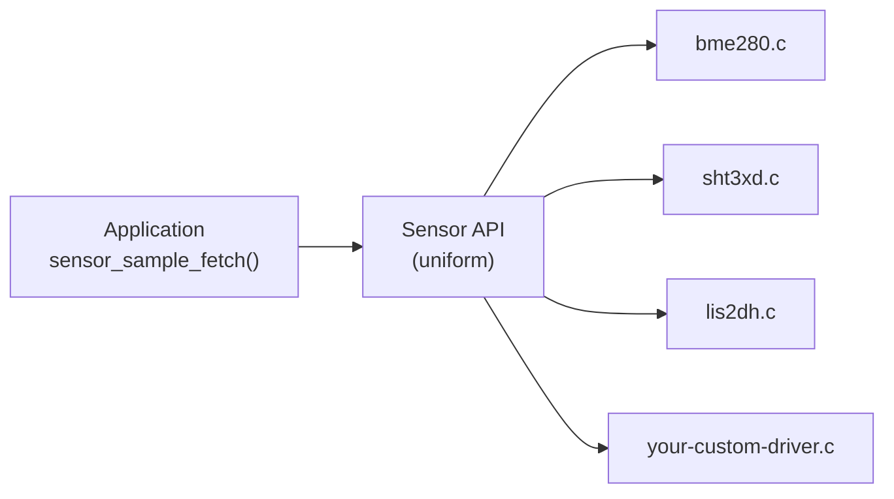

# Writing Drivers

You've spent five pages on the **consumer** side of the BME280:

- The [devicetree overlay](./devicetree) described it.
- The [binding YAML](./binding-yaml) validated it.
- The [Kconfig](./kconfig) compiled it in.
- The [sensor API](./i2c-sensors) read measurements from it.
- The [power management](./power-management) page suspended it between reads.

Every step ran through the in-tree `bosch,bme280` driver. This page flips the perspective — you build that driver yourself.

There are three reasons to reach for a custom driver, and the three exercises that follow map to each:

1. The hardware exists, but **Zephyr has no in-tree driver** for it.
2. The in-tree driver exists but **doesn't expose what you need** (raw register access, a vendor-specific calibration mode).
3. You're inventing a **new device class** that doesn't fit any existing Zephyr API.

<br/>

---

## The Zephyr driver model

Zephyr's driver model has one important property: **the API is decoupled from the implementation**. Your application calls `sensor_sample_fetch(dev)`; the kernel dispatches through a vtable to the right driver:



The contract is enforced by the **driver class API struct** — for sensors that's `struct sensor_driver_api`. Every sensor driver fills out this struct with its function pointers; `sensor_sample_fetch` is a thin wrapper that dereferences `dev->api->sample_fetch(dev, chan)`.

This is what makes the same `sensor_sample_fetch()` call work on hundreds of different sensors. Swap the driver, the application doesn't change.

<br/>

---

## The working tree

Two sibling directories: a Zephyr **application** that will consume the driver, and a **module** that will host it.

```
custom_bme280/
├── app/
│   ├── boards/
│   ├── src/
│   │   └── main.c
│   ├── prj.conf
│   └── CMakeLists.txt
│
└── custom_driver_module/
    └── drivers/
        └── sensor/
            └── custom_bme280/
                └── custom_bme280.c
```

The `app/` side is ordinary — same shape as every Zephyr app you've built. The `custom_driver_module/` side holds the driver source.

:::info
The CMake / Kconfig / `module.yml` glue that turns this folder into a real Zephyr module is a topic on its own — covered later in **Production Zephyr**. For this lesson, focus on the driver code itself.
:::

<br/>

---

## Exercise 1 — Custom BME280 using the sensor API

**Goal:** write a driver that talks SPI to a BME280 and exposes it through Zephyr's standard sensor API. The application then uses `sensor_sample_fetch` / `sensor_channel_get` exactly as it would for the in-tree driver.

### Step 1 — Binding

Define a `compatible` string for *your* version of the driver. We use `zephyr,custom-bme280` to distinguish it from the in-tree `bosch,bme280`:

```yaml title="dts/bindings/sensor/zephyr,custom-bme280.yaml"
description: BME280 integrated environmental sensor (custom driver)

compatible: "zephyr,custom-bme280"

include: [sensor-device.yaml, spi-device.yaml]
```

No custom properties — `spi-device.yaml` and `sensor-device.yaml` provide everything (the SPI bus, CS, max frequency, plus the sensor marker).

### Step 2 — `DT_DRV_COMPAT` and DTS guard

At the top of the driver:

```c title="drivers/sensor/custom_bme280/custom_bme280.c"
#define DT_DRV_COMPAT zephyr_custom_bme280

#include <zephyr/drivers/sensor.h>
#include <zephyr/drivers/spi.h>
#include <zephyr/logging/log.h>
LOG_MODULE_REGISTER(custom_bme280, CONFIG_SENSOR_LOG_LEVEL);

#if !DT_HAS_COMPAT_STATUS_OKAY(DT_DRV_COMPAT)
#warning "zephyr,custom-bme280 driver enabled without any devices"
#endif
```

`DT_DRV_COMPAT` is what binds the C file to the binding's `compatible` string (commas/hyphens → underscores). The `DT_HAS_COMPAT_STATUS_OKAY` guard catches the "Kconfig is on but the overlay forgot to add a node" case at build time.

### Step 3 — Data, config, and API structs

```c
struct custom_bme280_data {
    int32_t  comp_temp;
    uint32_t comp_press;
    uint32_t comp_humidity;
    /* … calibration coefficients … */
};

struct custom_bme280_config {
    struct spi_dt_spec spi;
};

static const struct sensor_driver_api custom_bme280_api = {
    .sample_fetch = custom_bme280_sample_fetch,
    .channel_get  = custom_bme280_channel_get,
};
```

The `sensor_driver_api` struct is the **vtable**. The kernel never calls `custom_bme280_sample_fetch` directly — it calls `sensor_sample_fetch(dev)`, which dereferences `dev->api->sample_fetch(dev, chan)`.

### Step 4 — `sample_fetch` and `channel_get`

```c
static int custom_bme280_sample_fetch(const struct device *dev,
                                      enum sensor_channel chan)
{
    const struct custom_bme280_config *cfg = dev->config;
    struct custom_bme280_data *data = dev->data;

    /* … read raw P/T/H registers over SPI, apply calibration … */
    return 0;
}

static int custom_bme280_channel_get(const struct device *dev,
                                     enum sensor_channel chan,
                                     struct sensor_value *val)
{
    struct custom_bme280_data *data = dev->data;

    switch (chan) {
    case SENSOR_CHAN_AMBIENT_TEMP:
        val->val1 = data->comp_temp / 100;
        val->val2 = (data->comp_temp % 100) * 10000;
        break;
    case SENSOR_CHAN_HUMIDITY:
        /* … */
        break;
    default:
        return -ENOTSUP;
    }
    return 0;
}
```

The full implementation (calibration register reads, two's-complement decoding, etc.) is the long part — the BME280 datasheet has the register map.

### Step 5 — Per-instance device macros

This is the magic that turns "one driver source file" into "N `struct device` instances, one per matching DTS node":

```c
static int custom_bme280_init(const struct device *dev);

#define CUSTOM_BME280_DEFINE(inst)                                      \
    static struct custom_bme280_data custom_bme280_data_##inst;         \
    static const struct custom_bme280_config custom_bme280_config_##inst = { \
        .spi = SPI_DT_SPEC_INST_GET(inst,                               \
                  SPI_WORD_SET(8) | SPI_TRANSFER_MSB, 0),               \
    };                                                                  \
    SENSOR_DEVICE_DT_INST_DEFINE(inst,                                  \
        custom_bme280_init, NULL,                                       \
        &custom_bme280_data_##inst,                                     \
        &custom_bme280_config_##inst,                                   \
        POST_KERNEL, CONFIG_SENSOR_INIT_PRIORITY,                       \
        &custom_bme280_api);

DT_INST_FOREACH_STATUS_OKAY(CUSTOM_BME280_DEFINE)
```

`DT_INST_FOREACH_STATUS_OKAY` walks every DTS node whose `compatible` matches `DT_DRV_COMPAT` and whose `status` is `"okay"`, expanding the `CUSTOM_BME280_DEFINE(inst)` macro for each one. If your overlay has two BME280s, you get two `struct device`s automatically.

<br/>

---

## Exercise 2 — Add power management

A sensor that polls once a minute doesn't need to stay powered the other 59 seconds. Zephyr's PM device API lets the driver suspend itself between operations and wake on demand.

### Step 1 — PM action callback

```c
#ifdef CONFIG_PM_DEVICE
static int custom_bme280_pm_action(const struct device *dev,
                                   enum pm_device_action action)
{
    int ret = 0;

    switch (action) {
    case PM_DEVICE_ACTION_RESUME:
        /* Wake the chip: write CTRLMEAS to enable normal mode */
        ret = bme280_set_mode(dev, BME280_MODE_NORMAL);
        break;
    case PM_DEVICE_ACTION_SUSPEND:
        /* Put the chip in sleep mode */
        ret = bme280_set_mode(dev, BME280_MODE_SLEEP);
        break;
    default:
        return -ENOTSUP;
    }
    return ret;
}
#endif
```

### Step 2 — Wrap fetch with runtime PM

In `sample_fetch`, request the device before talking to it and release after:

```c
static int custom_bme280_sample_fetch(const struct device *dev,
                                      enum sensor_channel chan)
{
    int ret;

    if (IS_ENABLED(CONFIG_PM_DEVICE_RUNTIME)) {
        pm_device_runtime_get(dev);
    }

    ret = bme280_read_measurements(dev);

    if (IS_ENABLED(CONFIG_PM_DEVICE_RUNTIME)) {
        pm_device_runtime_put(dev);
    }
    return ret;
}
```

Zephyr ref-counts the requests. If three different threads call `sample_fetch` simultaneously, the chip wakes once and sleeps once.

### Step 3 — Hook PM into the device macro

```c
#define CUSTOM_BME280_DEFINE(inst)                                      \
    /* … data and config structs as before … */                         \
    PM_DEVICE_DT_INST_DEFINE(inst, custom_bme280_pm_action);            \
    SENSOR_DEVICE_DT_INST_DEFINE(inst,                                  \
        custom_bme280_init,                                             \
        PM_DEVICE_DT_INST_GET(inst),    /* <- PM handle */              \
        &custom_bme280_data_##inst,                                     \
        &custom_bme280_config_##inst,                                   \
        POST_KERNEL, CONFIG_SENSOR_INIT_PRIORITY,                       \
        &custom_bme280_api);

DT_INST_FOREACH_STATUS_OKAY(CUSTOM_BME280_DEFINE)
```

<br/>

And in `prj.conf`:

```kconfig
CONFIG_PM_DEVICE=y
CONFIG_PM_DEVICE_RUNTIME=y
```

That's all the application needs. The driver handles the rest.

<br/>

---

## Exercise 3 — Create a custom driver API

The sensor API works because temperature, pressure, and humidity are concepts every sensor shares. When your device doesn't fit an existing class — say, a "blinking LED" with a configurable period — you create a new API.

Here we'll build a **`blink` driver class**: one operation, `set_period_ms()`, that any blink-capable device must implement. One concrete implementation (`blink-gpio-led`) drives the LED via GPIO; another could drive it via PWM.

### Step 1 — Binding for the concrete device

```yaml title="dts/bindings/blink-gpio-leds.yaml"
description: GPIO-controlled blinking LED.

compatible: "blink-gpio-led"

include: base.yaml

properties:
  led-gpios:
    type: phandle-array
    required: true
  blink-period-ms:
    type: int
```

### Step 2 — Public API header

The header defines:
- The **`blink_driver_api` struct** — the vtable each driver fills out
- A **public function** (`blink_set_period_ms`) that calls through the vtable
- A **userspace syscall wrapper** so user-mode apps can call it safely

```c title="include/blink.h"
#include <zephyr/device.h>
#include <zephyr/toolchain.h>

__subsystem struct blink_driver_api {
    int (*set_period_ms)(const struct device *dev, unsigned int period_ms);
};

__syscall int blink_set_period_ms(const struct device *dev,
                                  unsigned int period_ms);

static inline int z_impl_blink_set_period_ms(const struct device *dev,
                                             unsigned int period_ms)
{
    __ASSERT_NO_MSG(DEVICE_API_IS(blink, dev));
    return DEVICE_API_GET(blink, dev)->set_period_ms(dev, period_ms);
}

static inline int blink_off(const struct device *dev)
{
    return blink_set_period_ms(dev, 0);
}

#include <syscalls/blink.h>     /* auto-generated by the build */
```

`__subsystem` and `__syscall` are Zephyr macros that hook into the build system to generate the userspace shim. The `z_impl_` prefix is the convention for the kernel-mode implementation; userspace's `blink_set_period_ms` is generated from `__syscall` and routes through to it.

### Step 3 — Driver implementation against the new API

```c title="drivers/blink/gpio_led.c"
#define DT_DRV_COMPAT blink_gpio_led

#include <zephyr/drivers/gpio.h>
#include <blink.h>

struct blink_gpio_led_data {
    struct k_work_delayable blink_work;
    unsigned int period_ms;
};

struct blink_gpio_led_config {
    struct gpio_dt_spec led;
};

static int blink_gpio_led_set_period_ms(const struct device *dev,
                                        unsigned int period_ms)
{
    struct blink_gpio_led_data *data = dev->data;
    /* … reschedule the toggle work … */
    return 0;
}

static const struct blink_driver_api blink_gpio_led_api = {
    .set_period_ms = blink_gpio_led_set_period_ms,
};

static int blink_gpio_led_init(const struct device *dev);

#define BLINK_GPIO_LED_DEFINE(inst)                                         \
    static struct blink_gpio_led_data data##inst;                           \
    static const struct blink_gpio_led_config config##inst = {              \
        .led = GPIO_DT_SPEC_INST_GET(inst, led_gpios),                      \
    };                                                                      \
    DEVICE_DT_INST_DEFINE(inst, blink_gpio_led_init, NULL,                  \
        &data##inst, &config##inst,                                         \
        POST_KERNEL, CONFIG_BLINK_INIT_PRIORITY,                            \
        &blink_gpio_led_api);

DT_INST_FOREACH_STATUS_OKAY(BLINK_GPIO_LED_DEFINE)
```

Same pattern as Exercise 1 — but the API struct is **`blink_driver_api`** (defined by you), not `sensor_driver_api` (defined by Zephyr).

### From the application

```c
#include <blink.h>

const struct device *led = DEVICE_DT_GET_ANY(blink_gpio_led);
blink_set_period_ms(led, 500);   /* blink every 500 ms */
k_sleep(K_SECONDS(5));
blink_off(led);                  /* stop */
```

The application doesn't know whether `led` is GPIO-backed or PWM-backed. That's the whole point of the API class.

<br/>

---

## Summary — when to use which exercise

| Situation | Pattern |
|---|---|
| Hardware exists, Zephyr doesn't ship a driver for *your* variant | Exercise 1 — implement the standard API (sensor, led, display, …) |
| Battery-powered, sensor sleeps between reads | Exercise 2 — add `PM_DEVICE_DT_INST_DEFINE` + a `pm_action` callback |
| No existing Zephyr API fits the device's behavior | Exercise 3 — define a new driver class header and one or more implementations |

:::info
Reference: [Zephyr Device Drivers guide](https://docs.zephyrproject.org/latest/kernel/drivers/index.html).

The three exercises on this page (custom BME280 driver, adding PM, custom blink driver class) are adapted from the [Nordic Developer Academy nRF Connect SDK Intermediate — Lesson 7](https://academy.nordicsemi.com/courses/nrf-connect-sdk-intermediate/lessons/lesson-7-device-driver-dev/). The full reference source lives at [`NordicDeveloperAcademy/ncs-inter/l7`](https://github.com/NordicDeveloperAcademy/ncs-inter/tree/main/l7).
:::
