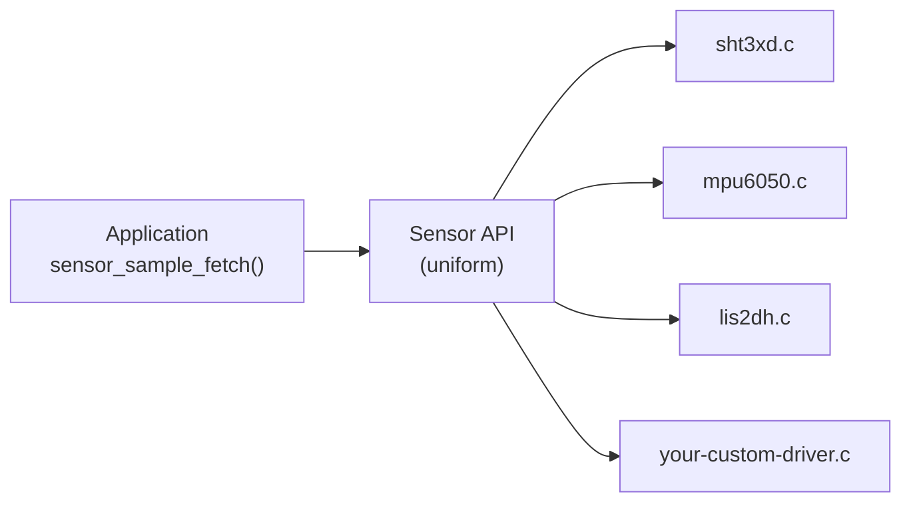

# Writing Drivers

You've spent five pages on the **consumer** side of the SHT30:

- The [devicetree](./devicetree) described it.
- The [binding YAML](./binding-yaml) validated it.
- The [Kconfig](./kconfig) compiled it in.
- The [sensor API](./i2c-sensors) read measurements from it.
- The [power management](./power-management) page found out it can't be suspended.

Every step ran through the in-tree `sensirion,sht3xd` driver. This page flips the perspective — you build that driver yourself.

There are three reasons to reach for a custom driver, and the three exercises that follow map to each:

1. The hardware exists, but **Zephyr has no in-tree driver** for it.
2. The in-tree driver exists but **doesn't expose what you need** (raw register access, a vendor-specific mode, power management).
3. You're inventing a **new device class** that doesn't fit any existing Zephyr API.

<br/>

---

## The Zephyr driver model

Zephyr's driver model has one important property: **the API is decoupled from the implementation**. Your application calls `sensor_sample_fetch(dev)`; the kernel dispatches through a vtable to the right driver:


```mermaid
graph LR
    A["Application<br/>sensor_sample_fetch()"] --> B["Sensor API<br/>(uniform)"]
    B --> C["sht3xd.c"]
    B --> D["mpu6050.c"]
    B --> E["lis2dh.c"]
    B --> F["your-custom-driver.c"]
```

The contract is enforced by the **driver class API struct** — for sensors that's `struct sensor_driver_api`. Every sensor driver fills out this struct with its function pointers; `sensor_sample_fetch` is a thin wrapper that dereferences `dev->api->sample_fetch(dev, chan)`.

This is what makes the same `sensor_sample_fetch()` call work on hundreds of different sensors. Swap the driver, the application doesn't change.

<br/>

---

## The working tree

Two sibling directories: a Zephyr **application** that will consume the driver, and a **module** that will host it.

```
custom_sht30/
├── app/
│   ├── boards/
│   ├── src/
│   │   └── main.c
│   ├── prj.conf
│   └── CMakeLists.txt
│
└── custom_driver_module/
    ├── dts/
    │   └── bindings/
    │       └── sensor/
    │           └── zephyr,custom-sht30.yaml
    └── drivers/
        └── sensor/
            └── custom_sht30/
                └── custom_sht30.c
```

The `app/` side is ordinary — same shape as every Zephyr app you've built. The `custom_driver_module/` side holds the binding and the driver source.

:::info
The CMake / Kconfig / `module.yml` glue that turns this folder into a real Zephyr module is a topic on its own — covered later in **Production Zephyr**. For this lesson, focus on the driver code itself.
:::

<br/>

---

## Exercise 1 — Custom SHT30 using the sensor API

**Goal:** write a driver that talks I2C to an SHT30 and exposes it through Zephyr's standard sensor API. The application then uses `sensor_sample_fetch` / `sensor_channel_get` exactly as it would for the in-tree `sht3xd` driver.

The SHT30 is a friendly first driver: no calibration registers, no compensation formulas. You send a 16-bit command, wait, and read back six bytes:

| Byte | 0 | 1 | 2 | 3 | 4 | 5 |
|---|---|---|---|---|---|---|
| Content | T MSB | T LSB | T CRC | RH MSB | RH LSB | RH CRC |

### Step 1 — Binding

Define a `compatible` string for *your* version of the driver. We use `zephyr,custom-sht30` to distinguish it from the in-tree `sensirion,sht3xd`:

```yaml title="dts/bindings/sensor/zephyr,custom-sht30.yaml"
description: SHT30 temperature and humidity sensor (custom driver)

compatible: "zephyr,custom-sht30"

include: [sensor-device.yaml, i2c-device.yaml]
```

No custom properties — `i2c-device.yaml` and `sensor-device.yaml` provide everything (the I2C bus, the `reg` address, plus the sensor marker). The SHT30 only speaks I2C, so there's no SPI variant to worry about.

### Step 2 — `DT_DRV_COMPAT` and DTS guard

At the top of the driver:

```c title="drivers/sensor/custom_sht30/custom_sht30.c"
#define DT_DRV_COMPAT zephyr_custom_sht30

#include <zephyr/device.h>
#include <zephyr/drivers/i2c.h>
#include <zephyr/drivers/sensor.h>
#include <zephyr/kernel.h>
#include <zephyr/sys/byteorder.h>
#include <zephyr/sys/crc.h>
#include <zephyr/logging/log.h>
LOG_MODULE_REGISTER(custom_sht30, CONFIG_SENSOR_LOG_LEVEL);

#if !DT_HAS_COMPAT_STATUS_OKAY(DT_DRV_COMPAT)
#warning "zephyr,custom-sht30 driver enabled without any devices"
#endif
```

`DT_DRV_COMPAT` is what binds the C file to the binding's `compatible` string (commas/hyphens → underscores). The `DT_HAS_COMPAT_STATUS_OKAY` guard catches the "Kconfig is on but the overlay forgot to add a node" case at build time.

### Step 3 — Data, config, and API structs

```c
#define SHT30_CMD_MEASURE_HIGH  0x2400  /* single shot, high repeatability */
#define SHT30_MEASURE_WAIT_MS   15

struct custom_sht30_data {
    uint16_t t_raw;     /* last raw temperature word */
    uint16_t rh_raw;    /* last raw humidity word */
};

struct custom_sht30_config {
    struct i2c_dt_spec i2c;
};

static DEVICE_API(sensor, custom_sht30_api) = {
    .sample_fetch = custom_sht30_sample_fetch,
    .channel_get  = custom_sht30_channel_get,
};
```

The `sensor_driver_api` struct is the **vtable** — `DEVICE_API(sensor, ...)` declares one and puts it where Zephyr can check that a device really implements the sensor API. The kernel never calls `custom_sht30_sample_fetch` directly — it calls `sensor_sample_fetch(dev)`, which dereferences `dev->api->sample_fetch(dev, chan)`. (In the actual file, the API struct sits *below* the two functions it points to.)

`config` holds what never changes (which bus, which address — straight from devicetree). `data` holds what does (the latest sample).

### Step 4 — `sample_fetch` and `channel_get`

`sample_fetch` does the I2C work; `channel_get` only converts what's already stored:

```c
static int sht30_write_cmd(const struct device *dev, uint16_t cmd)
{
    const struct custom_sht30_config *cfg = dev->config;
    uint8_t buf[2];

    sys_put_be16(cmd, buf);          /* commands are big-endian */
    return i2c_write_dt(&cfg->i2c, buf, sizeof(buf));
}

/* Each 16-bit word is followed by a CRC-8 (poly 0x31, init 0xFF). */
static bool sht30_crc_ok(const uint8_t *word)
{
    return crc8(word, 2, 0x31, 0xFF, false) == word[2];
}

static int custom_sht30_sample_fetch(const struct device *dev,
                                     enum sensor_channel chan)
{
    const struct custom_sht30_config *cfg = dev->config;
    struct custom_sht30_data *data = dev->data;
    uint8_t rx[6];
    int ret;

    if (chan != SENSOR_CHAN_ALL) {
        return -ENOTSUP;
    }

    ret = sht30_write_cmd(dev, SHT30_CMD_MEASURE_HIGH);
    if (ret < 0) {
        return ret;
    }

    k_sleep(K_MSEC(SHT30_MEASURE_WAIT_MS));   /* measurement in progress */

    ret = i2c_read_dt(&cfg->i2c, rx, sizeof(rx));
    if (ret < 0) {
        return ret;
    }

    if (!sht30_crc_ok(&rx[0]) || !sht30_crc_ok(&rx[3])) {
        return -EIO;
    }

    data->t_raw  = sys_get_be16(&rx[0]);
    data->rh_raw = sys_get_be16(&rx[3]);
    return 0;
}

static int custom_sht30_channel_get(const struct device *dev,
                                    enum sensor_channel chan,
                                    struct sensor_value *val)
{
    const struct custom_sht30_data *data = dev->data;

    switch (chan) {
    case SENSOR_CHAN_AMBIENT_TEMP:
        /* T = -45 + 175 * raw / 65535, in micro-degrees */
        return sensor_value_from_micro(val,
            -45000000LL + (int64_t)data->t_raw * 175000000LL / 65535);
    case SENSOR_CHAN_HUMIDITY:
        /* RH = 100 * raw / 65535, in micro-percent */
        return sensor_value_from_micro(val,
            (int64_t)data->rh_raw * 100000000LL / 65535);
    default:
        return -ENOTSUP;
    }
}
```

That's the whole protocol. The two conversion formulas and the CRC parameters come straight from the SHT3x datasheet ("Conversion of Signal Output" and "Checksum Calculation"). `sensor_value_from_micro()` splits a micro-unit number into the integer + fractional parts of a `struct sensor_value`, so you don't do that arithmetic by hand.

:::tip[Compare with the real one]
Open `zephyr/drivers/sensor/sensirion/sht3xd/sht3xd.c` next to yours. Its single-shot path is the same three moves — write command, `k_sleep`, `i2c_read_dt` six bytes, check both CRCs. The in-tree driver adds a periodic mode and an ALERT-pin trigger on top.
:::

### Step 5 — Per-instance device macros

This is the magic that turns "one driver source file" into "N `struct device` instances, one per matching DTS node":

```c
static int custom_sht30_init(const struct device *dev)
{
    const struct custom_sht30_config *cfg = dev->config;

    if (!i2c_is_ready_dt(&cfg->i2c)) {
        LOG_ERR("I2C bus not ready");
        return -ENODEV;
    }
    return 0;
}

#define CUSTOM_SHT30_DEFINE(inst)                                        \
    static struct custom_sht30_data custom_sht30_data_##inst;            \
    static const struct custom_sht30_config custom_sht30_config_##inst = { \
        .i2c = I2C_DT_SPEC_INST_GET(inst),                               \
    };                                                                   \
    SENSOR_DEVICE_DT_INST_DEFINE(inst,                                   \
        custom_sht30_init, NULL,                                         \
        &custom_sht30_data_##inst,                                       \
        &custom_sht30_config_##inst,                                     \
        POST_KERNEL, CONFIG_SENSOR_INIT_PRIORITY,                        \
        &custom_sht30_api);

DT_INST_FOREACH_STATUS_OKAY(CUSTOM_SHT30_DEFINE)
```

`DT_INST_FOREACH_STATUS_OKAY` walks every DTS node whose `compatible` matches `DT_DRV_COMPAT` and whose `status` is `"okay"`, expanding the `CUSTOM_SHT30_DEFINE(inst)` macro for each one. If your board has two SHT30s (one at `0x44`, one at `0x45`), you get two `struct device`s automatically.

`I2C_DT_SPEC_INST_GET(inst)` pulls the bus and the `reg` address out of the devicetree node — the driver never hardcodes `0x44`.

### Step 6 — Point a devicetree node at your driver

The driver only runs if a node carries its `compatible`:

<BoardTabs>
<BoardTab value="esp32s3_devkitc">

Add the SHT30 module on I2C0 (SDA GPIO1, SCL GPIO2) with *your* compatible:

```dts title="app/boards/esp32s3_devkitc_procpu.overlay"
&i2c0 {
	status = "okay";
	clock-frequency = <I2C_BITRATE_STANDARD>;

	sht30: sht30@44 {
		compatible = "zephyr,custom-sht30";
		reg = <0x44>;
	};
};
```

</BoardTab>
<BoardTab value="efz_esp32s3">

The board already has the SHT30 node (label `sht30`, `sensirion,sht3xd`). Overwrite just its `compatible`, and the in-tree driver steps aside for yours:

```dts title="app/boards/efz_esp32s3_procpu.overlay"
&sht30 {
	compatible = "zephyr,custom-sht30";
};
```

</BoardTab>
</BoardTabs>

The application code from the [sensor API page](./i2c-sensors) doesn't change at all — it still asks for `DT_NODELABEL(sht30)` and calls `sensor_sample_fetch()`. That's the payoff of the driver model: you swapped the entire driver underneath and the app never noticed.

<br/>

---

## Exercise 2 — Add power management

The [power management page](./power-management) ended on a gap: the in-tree `sht3xd` driver has **no PM support**, so `pm_device_action_run()` has nothing to call. Your driver can fill that gap.

What should "suspend" mean for an SHT30? In single-shot mode the chip already drops to idle after every measurement. But if anything left it in **periodic** mode (measuring on its own, several times a second), it keeps drawing current until it receives the *Break* command, `0x3093`. So our suspend sends Break — the sensor is guaranteed idle, whatever state it was in. On a board where the sensor's supply goes through a load switch, this callback is also where you'd switch the power off.

### Step 1 — PM action callback

```c
#include <zephyr/pm/device.h>
#include <zephyr/pm/device_runtime.h>

#define SHT30_CMD_BREAK  0x3093  /* stop periodic mode -> idle */

#ifdef CONFIG_PM_DEVICE
static int custom_sht30_pm_action(const struct device *dev,
                                  enum pm_device_action action)
{
    switch (action) {
    case PM_DEVICE_ACTION_SUSPEND:
        /* Make sure the chip is idle, not measuring periodically */
        return sht30_write_cmd(dev, SHT30_CMD_BREAK);
    case PM_DEVICE_ACTION_RESUME:
        /* Nothing to do: the next single-shot command wakes it */
        return 0;
    default:
        return -ENOTSUP;
    }
}
#endif
```

### Step 2 — Wrap fetch with runtime PM

In `sample_fetch`, request the device before talking to it and release after. The I2C transaction from Exercise 1 moves into a helper, `sht30_read_measurement()`:

```c
static int custom_sht30_sample_fetch(const struct device *dev,
                                     enum sensor_channel chan)
{
    int ret;

    if (chan != SENSOR_CHAN_ALL) {
        return -ENOTSUP;
    }

    ret = pm_device_runtime_get(dev);     /* resume if suspended */
    if (ret < 0) {
        return ret;
    }

    ret = sht30_read_measurement(dev);    /* command, wait, read, CRC */

    (void)pm_device_runtime_put(dev);     /* suspend when last user is done */
    return ret;
}
```

Zephyr ref-counts the requests. If three different threads call `sample_fetch` simultaneously, the chip wakes once and sleeps once. With `CONFIG_PM_DEVICE_RUNTIME` off, both calls compile to stubs that return 0 — the same driver works either way.

Runtime PM is off per device until someone turns it on. Do it at the end of `init`:

```c
static int custom_sht30_init(const struct device *dev)
{
    /* … bus-ready check as before … */
    return pm_device_runtime_enable(dev);
}
```

(Alternatively, add `zephyr,pm-device-runtime-auto;` to the devicetree node and Zephyr enables it for you.)

### Step 3 — Hook PM into the device macro

```c
#define CUSTOM_SHT30_DEFINE(inst)                                        \
    /* … data and config structs as before … */                          \
    PM_DEVICE_DT_INST_DEFINE(inst, custom_sht30_pm_action);              \
    SENSOR_DEVICE_DT_INST_DEFINE(inst,                                   \
        custom_sht30_init,                                               \
        PM_DEVICE_DT_INST_GET(inst),    /* <- PM handle */               \
        &custom_sht30_data_##inst,                                       \
        &custom_sht30_config_##inst,                                     \
        POST_KERNEL, CONFIG_SENSOR_INIT_PRIORITY,                        \
        &custom_sht30_api);

DT_INST_FOREACH_STATUS_OKAY(CUSTOM_SHT30_DEFINE)
```

<br/>

And in `prj.conf`:

```kconfig
CONFIG_PM_DEVICE=y
CONFIG_PM_DEVICE_RUNTIME=y
```

That's all the application needs. The driver handles the rest — and now `pm_device_action_run(sht30, PM_DEVICE_ACTION_SUSPEND)` returns `0` instead of `-ENOSYS`.

<br/>

---

## Exercise 3 — Create a custom driver API

The sensor API works because temperature and humidity are concepts every sensor shares. When your device doesn't fit an existing class — say, a "blinking LED" with a configurable period — you create a new API.

Here we'll build a **`blink` driver class**: one operation, `set_period_ms()`, that any blink-capable device must implement. One concrete implementation (`blink-gpio-led`) drives the LED via GPIO; another could drive it via PWM.

### Step 1 — Binding for the concrete device

```yaml title="dts/bindings/blink-gpio-leds.yaml"
description: GPIO-controlled blinking LED.

compatible: "blink-gpio-led"

include: base.yaml

properties:
  led-gpios:
    type: phandle-array
    required: true
  blink-period-ms:
    type: int
```

### Step 2 — Public API header

The header defines:
- The **`blink_driver_api` struct** — the vtable each driver fills out
- A **public function** (`blink_set_period_ms`) that calls through the vtable
- A **userspace syscall wrapper** so user-mode apps can call it safely

```c title="include/blink.h"
#include <zephyr/device.h>
#include <zephyr/toolchain.h>

__subsystem struct blink_driver_api {
    int (*set_period_ms)(const struct device *dev, unsigned int period_ms);
};

__syscall int blink_set_period_ms(const struct device *dev,
                                  unsigned int period_ms);

static inline int z_impl_blink_set_period_ms(const struct device *dev,
                                             unsigned int period_ms)
{
    __ASSERT_NO_MSG(DEVICE_API_IS(blink, dev));
    return DEVICE_API_GET(blink, dev)->set_period_ms(dev, period_ms);
}

static inline int blink_off(const struct device *dev)
{
    return blink_set_period_ms(dev, 0);
}

#include <zephyr/syscalls/blink.h>     /* auto-generated by the build */
```

`__subsystem` and `__syscall` are Zephyr macros that hook into the build system to generate the userspace shim. The `z_impl_` prefix is the convention for the kernel-mode implementation; userspace's `blink_set_period_ms` is generated from `__syscall` and routes through to it.

### Step 3 — Driver implementation against the new API

```c title="drivers/blink/gpio_led.c"
#define DT_DRV_COMPAT blink_gpio_led

#include <zephyr/drivers/gpio.h>
#include <blink.h>

struct blink_gpio_led_data {
    struct k_work_delayable blink_work;
    unsigned int period_ms;
};

struct blink_gpio_led_config {
    struct gpio_dt_spec led;
};

static int blink_gpio_led_set_period_ms(const struct device *dev,
                                        unsigned int period_ms)
{
    struct blink_gpio_led_data *data = dev->data;
    /* … reschedule the toggle work … */
    return 0;
}

static const struct blink_driver_api blink_gpio_led_api = {
    .set_period_ms = blink_gpio_led_set_period_ms,
};

static int blink_gpio_led_init(const struct device *dev);

#define BLINK_GPIO_LED_DEFINE(inst)                                         \
    static struct blink_gpio_led_data data##inst;                           \
    static const struct blink_gpio_led_config config##inst = {              \
        .led = GPIO_DT_SPEC_INST_GET(inst, led_gpios),                      \
    };                                                                      \
    DEVICE_DT_INST_DEFINE(inst, blink_gpio_led_init, NULL,                  \
        &data##inst, &config##inst,                                         \
        POST_KERNEL, CONFIG_BLINK_INIT_PRIORITY,                            \
        &blink_gpio_led_api);

DT_INST_FOREACH_STATUS_OKAY(BLINK_GPIO_LED_DEFINE)
```

Same pattern as Exercise 1 — but the API struct is **`blink_driver_api`** (defined by you), not `sensor_driver_api` (defined by Zephyr).

### From the application

```c
#include <blink.h>

const struct device *led = DEVICE_DT_GET_ANY(blink_gpio_led);
blink_set_period_ms(led, 500);   /* blink every 500 ms */
k_sleep(K_SECONDS(5));
blink_off(led);                  /* stop */
```

The application doesn't know whether `led` is GPIO-backed or PWM-backed. That's the whole point of the API class.

<br/>

---

## Summary — when to use which exercise

| Situation | Pattern |
|---|---|
| Hardware exists, Zephyr doesn't ship a driver for *your* variant | Exercise 1 — implement the standard API (sensor, led, display, …) |
| The driver works but can't be suspended (like the in-tree `sht3xd`) | Exercise 2 — add `PM_DEVICE_DT_INST_DEFINE` + a `pm_action` callback |
| No existing Zephyr API fits the device's behavior | Exercise 3 — define a new driver class header and one or more implementations |

:::info
Reference: [Zephyr Device Drivers guide](https://docs.zephyrproject.org/latest/kernel/drivers/index.html).

The three exercises on this page (custom sensor driver, adding PM, custom blink driver class) are adapted from the [Nordic Developer Academy nRF Connect SDK Intermediate — Lesson 7](https://academy.nordicsemi.com/courses/nrf-connect-sdk-intermediate/lessons/lesson-7-device-driver-dev/), reworked here around the SHT30 on the EFZ board. The Academy's reference source lives at [`NordicDeveloperAcademy/ncs-inter/l7`](https://github.com/NordicDeveloperAcademy/ncs-inter/tree/main/l7).
:::
