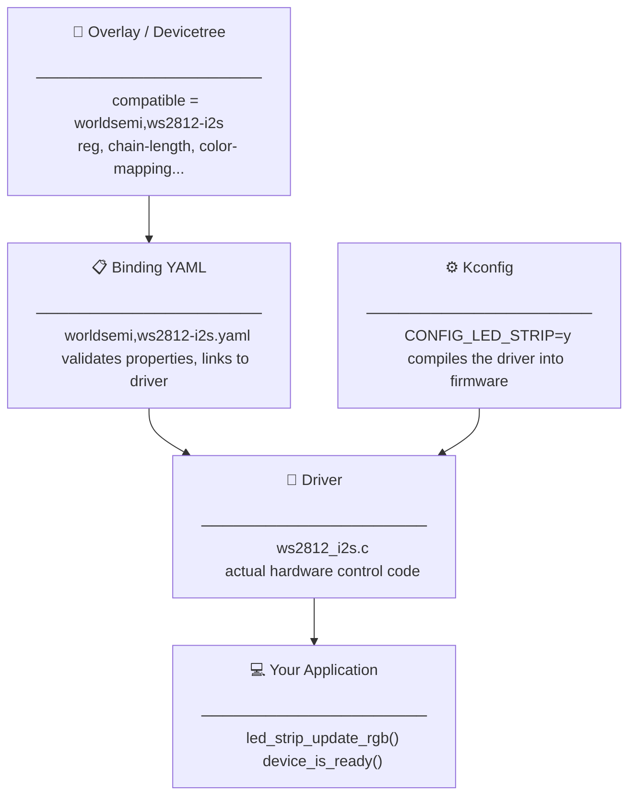

# How Zephyr Fits Together

In Basic, you wrote this in the overlay:

```dts
compatible = "worldsemi,ws2812-i2s";
```

You added this to `prj.conf`:

```kconfig
CONFIG_LED_STRIP=y
```

And you called this in your application:

```c
led_strip_update_rgb(strip, pixels, STRIP_NUM_PIXELS);
```

It worked. But **why** did it work? How does a string in a text file end up calling the right C function on the right hardware pin?

This page answers that question before you go deeper into each layer.

<br/>

---

## The four layers

Zephyr uses four layers that work together at build time and runtime:



Each layer has one job. Together they form an unbroken chain from hardware description to function call.

<br/>

---

## Layer 1 — Overlay: describe the hardware

The overlay answers the question: **what hardware exists on this board?**

```dts title="boards/esp32s3_devkitc_esp32s3_procpu.overlay"
i2s_led: &i2s0 {
    led_strip: ws2812@0 {
        compatible = "worldsemi,ws2812-i2s";
        chain-length = <1>;
        color-mapping = <LED_COLOR_ID_GREEN LED_COLOR_ID_RED LED_COLOR_ID_BLUE>;
    };
};
```

This is a **hardware description**, not code. It says: "there is a WS2812 device, it sits on I2S0, it has one LED, it uses GRB color order." No C, no logic — just facts about the board.

The `compatible` string is the key. It is the link to the next layer.

<br/>

---

## Layer 2 — Binding: validate the overlay

The binding answers: **what properties is this node allowed to have, and what do they mean?**

Zephyr finds the binding by looking up the `compatible` string:

```
compatible = "worldsemi,ws2812-i2s"
          ↓
zephyr/dts/bindings/led_strip/worldsemi,ws2812-i2s.yaml
```

The binding YAML defines:
- Which properties are **required** (build error if missing)
- Which are **optional**
- What **type** each property is (`int`, `array`, `string`...)
- Which **C header** contains the constants (`LED_COLOR_ID_GREEN`, etc.)

If your overlay has a typo — `chan-length` instead of `chain-length` — the binding catches it at build time and tells you exactly what went wrong.


<br/>

---

## Layer 3 — Kconfig: compile the driver

The driver only exists in firmware if Kconfig says so. `CONFIG_LED_STRIP=y` tells the build system to compile the LED strip driver code into your binary.

```kconfig title="prj.conf"
CONFIG_LED_STRIP=y
```

Without this line, the driver source file is **never compiled** — it takes zero flash space and zero RAM. With it, the driver is built and linked.

This is how Zephyr keeps firmware lean: every subsystem is opt-in. A bare `prj.conf` produces minimal firmware. You grow it by enabling exactly what you need.

:::warning[Both are required]
The overlay describes the hardware. Kconfig compiles the driver. **You need both.** Miss either one and you get no device.
:::

<br/>

---

## Layer 4 — Driver: the actual hardware code

The driver answers: **how do you talk to this hardware?**

This is where the `compatible` string actually selects the driver. At the top of `ws2812_i2s.c`:

```c
#define DT_DRV_COMPAT worldsemi_ws2812_i2s
```

This one line tells Zephyr: "this driver handles all DTS nodes with `compatible = "worldsemi,ws2812-i2s"`." The comma becomes an underscore, hyphens become underscores — that is the only translation.

At build time, Zephyr uses this to:

1. Read your overlay properties (`chain-length`, `color-mapping`, etc.) and pass them to the driver
2. Create a `struct device` instance for the node
3. Call the driver's `init()` function at boot — before your `main()` runs

By the time your `main()` runs, the device is already initialized. `device_is_ready()` confirms it.

Your application never calls the driver directly — it calls the **LED strip API** (`led_strip_update_rgb`), and Zephyr dispatches to the correct driver underneath. This is why the same application code works on SPI-based, I2S-based, or GPIO-based WS2812 strips — only the overlay and driver change.

<br/>

---

## The full picture — one example, four layers

| Layer | File | Role in WS2812 |
|---|---|---|
| Overlay | `boards/esp32s3_devkitc_esp32s3_procpu.overlay` | Says the LED exists on I2S0, GPIO48, 1 pixel, GRB |
| Binding | `dts/bindings/led_strip/worldsemi,ws2812-i2s.yaml` | Validates `chain-length`, `color-mapping`, links to driver |
| Kconfig | `prj.conf` → `CONFIG_LED_STRIP=y` | Compiles the WS2812 I2S driver into firmware |
| Driver | `drivers/led_strip/ws2812_i2s.c` | Sends pixel data over I2S + DMA at runtime |

**Build time:** Overlay + Binding + Kconfig → validated, compiled firmware  
**Runtime:** `device_is_ready()` + `led_strip_update_rgb()` → pixels on screen

<br/>

---

## What comes next?

Each of the following pages focuses on one layer, in order:

| Layer | Page | What you'll learn |
|---|---|---|
| 1 — Overlay | **[Devicetree](./devicetree)** | The three-layer DTS model — SoC, board, and your overlay |
| 2 — Binding | **[DTS Binding YAML](./binding-yaml)** | How to write and read binding YAML files |
| 3 — Kconfig | **[Kconfig](./kconfig)** | How to find the right `CONFIG_` symbol and understand dependencies |
| 4 — Driver | **[Writing Drivers](./writing-drivers)** | How `DT_DRV_COMPAT` ties a driver to its compatible string |

By the end of this section, every line in that WS2812 overlay will make complete sense.
