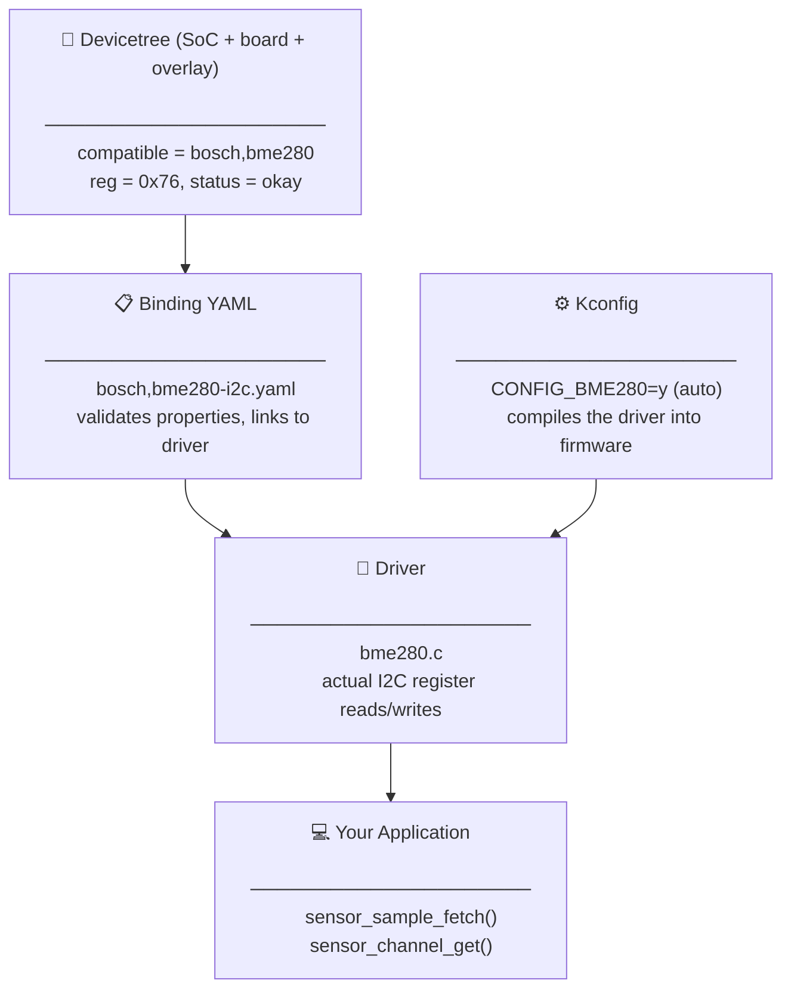

# How Zephyr Fits Together

In Basic, you turned on a WS2812 LED. Three text fragments did all the work:

```dts title="overlay"
compatible = "worldsemi,ws2812-i2s";
```
<br/>

```kconfig title="prj.conf"
CONFIG_LED_STRIP=y
```

<br/>

```c title="src/main.c"
led_strip_update_rgb(strip, pixels, STRIP_NUM_PIXELS);
```

It worked. But **why** did it work? How does a string in a text file end up calling the right C function on the right hardware pin? Those three lines touched four separate Zephyr subsystems, but you didn't have to think about how they connected.

This page answers that question.

The mechanism is the same for every Zephyr driver — WS2812, button GPIO, USB CDC, anything. To walk through it in detail we'll switch examples to the **Bosch BME280**, the most common temperature / humidity / pressure sensor in real projects. The shape is identical to the WS2812 chain you already built; the BME280 just gives us a richer, more representative driver to dissect.

<br/>

---

## The same chain, on BME280

A BME280 on I2C needs three text files and zero hand-written driver code — exactly like WS2812:

```dts title="myapp.overlay"
&i2c0 {
    status = "okay";
    bme280: bme280@76 {
        compatible = "bosch,bme280";
        reg = <0x76>;
    };
};
```
<br/>
```kconfig title="prj.conf"
CONFIG_I2C=y
CONFIG_SENSOR=y
```

<br/>

```c title="src/main.c"
const struct device *bme = DEVICE_DT_GET(DT_NODELABEL(bme280));
sensor_sample_fetch(bme);
```

Now: how does `"bosch,bme280"` end up calling the right I2C reads on the BME280 chip?

<br/>

---

## The four layers

Zephyr uses four layers that work together at build time and runtime:


```mermaid
graph TD
    A["📄 Devicetree (SoC + board + overlay)
    ─────────────────────
    compatible = bosch,bme280
    reg = 0x76, status = okay"]

    B["📋 Binding YAML
    ─────────────────────
    bosch,bme280-i2c.yaml
    validates properties, links to driver"]

    C["⚙️ Kconfig
    ─────────────────────
    CONFIG_BME280=y (auto)
    compiles the driver into firmware"]

    D["🔧 Driver
    ─────────────────────
    bme280.c
    actual I2C register reads/writes"]

    E["💻 Your Application
    ─────────────────────
    sensor_sample_fetch()
    sensor_channel_get()"]

    A --> B
    B --> D
    C --> D
    D --> E
```

Each layer has one job. Together they form an unbroken chain from hardware description to function call.

<br/>

---

## Layer 1 — Devicetree: describe the hardware

The devicetree answers the question: **what hardware exists on this board?**

It is assembled at build time from three files: the SoC's base DTS, the board's DTS, and your application's **overlay** — your slice on top, where you describe what you wired up:

```dts title="boards/esp32s3_devkitc_esp32s3_procpu.overlay"
&i2c0 {
    status = "okay";
    clock-frequency = <I2C_BITRATE_FAST>;

    bme280: bme280@76 {
        compatible = "bosch,bme280";
        reg = <0x76>;
    };
};
```

This is a **hardware description**, not code. It says: "there is a BME280 device, it sits on `i2c0`, its 7-bit address is `0x76`." No C, no logic — just facts about the board.

The `compatible` string is the key. It is the link to the next layer.

<br/>

---

## Layer 2 — Binding: validate the overlay

The binding answers: **what properties is this node allowed to have, and what do they mean?**

Zephyr finds the binding by looking up the `compatible` string:

```
compatible = "bosch,bme280"
          ↓
zephyr/dts/bindings/sensor/bosch,bme280-i2c.yaml
```

<br/>

The actual file is tiny:

```yaml title="bosch,bme280-i2c.yaml"
description: BME280 integrated environmental sensor

compatible: "bosch,bme280"

include: [sensor-device.yaml, i2c-device.yaml]
```

It declares no custom properties at all. Everything comes from the two `include:` files:
- `i2c-device.yaml` provides `reg` (the I2C address) and validates the unit address.
- `sensor-device.yaml` marks this as a sensor for the build system, so the sensor API works on it.

There's also a `bosch,bme280-spi.yaml` — same `compatible`, but `include: [sensor-device.yaml, spi-device.yaml]`. Zephyr picks the right binding based on which bus the BME280 sits on.

If your overlay misspells `reg` or omits a required field, the binding catches it at build time and tells you exactly what went wrong.

<br/>

---

## Layer 3 — Kconfig: compile the driver

The driver only exists in firmware if Kconfig says so. The BME280 driver auto-enables itself the moment a matching DTS node appears:

```kconfig title="drivers/sensor/bosch/bme280/Kconfig"
menuconfig BME280
    bool "BME280/BMP280 sensor"
    default y
    depends on DT_HAS_BOSCH_BME280_ENABLED
    select I2C if $(dt_compat_on_bus,$(DT_COMPAT_BOSCH_BME280),i2c)
    select SPI if $(dt_compat_on_bus,$(DT_COMPAT_BOSCH_BME280),spi)
```

Three things to notice:
- **`depends on DT_HAS_BOSCH_BME280_ENABLED`** — this symbol is auto-generated when Zephyr sees `compatible = "bosch,bme280"` somewhere in the merged tree. **The overlay triggers the Kconfig.**
- **`default y`** — once the dependency is met, `BME280` is on. You don't write `CONFIG_BME280=y` yourself.
- **`select I2C if … on-bus i2c`** — the driver pulls in the I2C subsystem only if your BME280 is actually on an I2C bus. If you wire it via SPI, it pulls in SPI instead.

This is how `CONFIG_SENSOR=y` in `prj.conf` is enough to bring up the BME280 — every other knob resolves automatically from the overlay.

:::warning[Both are required]
The overlay describes the hardware. Kconfig compiles the driver. **You need both.** Miss either one and you get no device.
:::

<br/>

---

## Layer 4 — Driver: the actual hardware code

The driver answers: **how do you talk to this hardware?**

This is where the `compatible` string actually selects the driver. At the top of `bme280.c`:

```c
#define DT_DRV_COMPAT bosch_bme280
```

This one line tells Zephyr: "this driver handles all DTS nodes with `compatible = "bosch,bme280"`." The comma becomes an underscore, hyphens become underscores — that is the only translation.

At build time, Zephyr uses this to:

1. Read your overlay properties (`reg`, plus everything from the includes) and pass them to the driver
2. Create a `struct device` instance for the node
3. Call the driver's `init()` function at boot — before your `main()` runs

By the time your `main()` runs, the device is already initialized. `device_is_ready()` confirms it.

Your application never calls the driver directly — it calls the **sensor API** (`sensor_sample_fetch`, `sensor_channel_get`), and Zephyr dispatches to the BME280 driver underneath. This is why the same application code works on a BME280, a SHT31, or a LIS2DH — only the overlay and driver change.

<br/>

---

## The full picture — one example, four layers

| Layer | File | Role in BME280 |
|---|---|---|
| Devicetree | `myapp.overlay` (your slice of the full DTS) | Says the BME280 exists on `i2c0`, address `0x76` |
| Binding | `dts/bindings/sensor/bosch,bme280-i2c.yaml` | Pulls in `i2c-device.yaml` + `sensor-device.yaml` — no custom properties |
| Kconfig | `drivers/sensor/bosch/bme280/Kconfig` | Auto-enables `CONFIG_BME280` and `select`s I2C from the overlay |
| Driver | `drivers/sensor/bosch/bme280/bme280.c` | Reads BME280 calibration + measurement registers over I2C |

**Build time:** Overlay + Binding + Kconfig → validated, compiled firmware
**Runtime:** `device_is_ready()` + `sensor_sample_fetch()` → temperature, humidity, pressure

<br/>

---

## What comes next?

Each of the following pages focuses on one layer, in order:

| Layer | Page | What you'll learn |
|---|---|---|
| 1 — Devicetree | **[Devicetree](./devicetree)** | The three-layer DTS model — SoC, board, and your overlay |
| 2 — Binding | **[DTS Binding YAML](./binding-yaml)** | How to write and read binding YAML files |
| 3 — Kconfig | **[Kconfig](./kconfig)** | How to find the right `CONFIG_` symbol and understand dependencies |
| 4 — Driver | **[Writing Drivers](./writing-drivers)** | How `DT_DRV_COMPAT` ties a driver to its compatible string |

By the end of this section, every line in that BME280 overlay will make complete sense.
