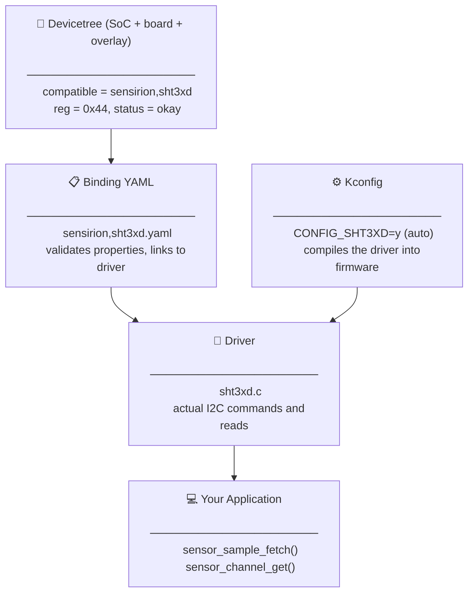

# How Zephyr Fits Together

In Basic, you turned on a WS2812 LED. Three text fragments did all the work:

```dts title="overlay"
compatible = "worldsemi,ws2812-i2s";
```
<br/>

```kconfig title="prj.conf"
CONFIG_LED_STRIP=y
```

<br/>

```c title="src/main.c"
led_strip_update_rgb(strip, pixels, STRIP_NUM_PIXELS);
```

It worked. But **why** did it work? How does a string in a text file end up calling the right C function on the right hardware pin? Those three lines touched four separate Zephyr subsystems, but you didn't have to think about how they connected.

This page answers that question.

The mechanism is the same for every Zephyr driver — WS2812, button GPIO, USB CDC, anything. To walk through it in detail we'll switch examples to the **Sensirion SHT30**, a small I2C temperature / humidity sensor. It's soldered on the EFZ-ESP32S3, and a cheap breakout module works on the DevKitC. The shape is identical to the WS2812 chain you already built; the SHT30 just gives us a real sensor driver to dissect.

<br/>

---

## The same chain, on SHT30

An SHT30 on I2C needs a devicetree node, one line of config and zero hand-written driver code — exactly like WS2812:

```dts title="devicetree"
&i2c0 {
    status = "okay";
    sht30: sht3xd@44 {
        compatible = "sensirion,sht3xd";
        reg = <0x44>;
    };
};
```
<br/>
```kconfig title="prj.conf"
CONFIG_SENSOR=y
```

<br/>

```c title="src/main.c"
const struct device *sht30 = DEVICE_DT_GET(DT_NODELABEL(sht30));
sensor_sample_fetch(sht30);
```

Now: how does `"sensirion,sht3xd"` end up calling the right I2C transfers on the SHT30 chip?

<br/>

---

## The four layers

Zephyr uses four layers that work together at build time and runtime:


```mermaid
graph TD
    A["📄 Devicetree (SoC + board + overlay)
    ─────────────────────
    compatible = sensirion,sht3xd
    reg = 0x44, status = okay"]

    B["📋 Binding YAML
    ─────────────────────
    sensirion,sht3xd.yaml
    validates properties, links to driver"]

    C["⚙️ Kconfig
    ─────────────────────
    CONFIG_SHT3XD=y (auto)
    compiles the driver into firmware"]

    D["🔧 Driver
    ─────────────────────
    sht3xd.c
    actual I2C commands and reads"]

    E["💻 Your Application
    ─────────────────────
    sensor_sample_fetch()
    sensor_channel_get()"]

    A --> B
    B --> D
    C --> D
    D --> E
```

Each layer has one job. Together they form an unbroken chain from hardware description to function call.

<br/>

---

## Layer 1 — Devicetree: describe the hardware

The devicetree answers the question: **what hardware exists on this board?**

It is assembled at build time from three files: the SoC's base DTS, the board's DTS, and your application's **overlay** — your slice on top. Where the SHT30 node lives depends on your board, and that difference is the whole point of the layering:

<BoardTabs>
<BoardTab value="esp32s3_devkitc">

The DevKitC has no sensor on board. You wire an SHT30 module to I2C0 (SDA GPIO1, SCL GPIO2), so **you** describe it in your overlay:

```dts title="boards/esp32s3_devkitc_procpu.overlay"
&i2c0 {
    status = "okay";
    clock-frequency = <I2C_BITRATE_STANDARD>;

    sht30: sht3xd@44 {
        compatible = "sensirion,sht3xd";
        reg = <0x44>;
    };
};
```

</BoardTab>
<BoardTab value="efz_esp32s3">

The SHT30 is **soldered on the board**, so the board's own devicetree already describes it — you write **no overlay at all**. This is the node in [`efz_esp32s3_procpu.dts`](https://github.com/huunghiaspkt/zephyr/blob/main/boards/embeddedfun/efz_esp32s3/efz_esp32s3_procpu.dts):

```dts title="boards/embeddedfun/efz_esp32s3/efz_esp32s3_procpu.dts"
&i2c0 {
    status = "okay";
    clock-frequency = <I2C_BITRATE_FAST>;
    pinctrl-0 = <&i2c0_default>;
    pinctrl-names = "default";

    sht30: sht3xd@44 {
        compatible = "sensirion,sht3xd";
        reg = <0x44>;
    };
};
```

</BoardTab>
</BoardTabs>

Either way, the merged tree ends up with the same node: "there is an SHT30, it sits on `i2c0`, its 7-bit address is `0x44`." No C, no logic — just facts about the hardware. Hardware that's **permanently on the PCB** belongs in the board DTS; hardware **you add** belongs in your overlay.

The `compatible` string is the key. It is the link to the next layer.

<br/>

---

## Layer 2 — Binding: validate the node

The binding answers: **what properties is this node allowed to have, and what do they mean?**

Zephyr finds the binding by looking up the `compatible` string:

```
compatible = "sensirion,sht3xd"
          ↓
zephyr/dts/bindings/sensor/sensirion,sht3xd.yaml
```

<br/>

The actual file is tiny:

```yaml title="sensirion,sht3xd.yaml"
description: Sensirion Humidity SHT3x-DIS humidity and temperature sensor

compatible: "sensirion,sht3xd"

include: [sensor-device.yaml, i2c-device.yaml]

properties:
  alert-gpios:
    type: phandle-array
    description: |
      ALERT pin.

      This pin signals active high when produced by the sensor.  The
      property value should ensure the flags properly describe the
      signal that is presented to the driver.
```

It declares just one custom property — the optional `alert-gpios`. Everything else comes from the two `include:` files:
- `i2c-device.yaml` provides `reg` (the I2C address) and validates the unit address.
- `sensor-device.yaml` marks this as a sensor for the build system, so the sensor API works on it.

The SHT30 only speaks I2C, so there's a single binding. (Sensors that can sit on either I2C or SPI ship one binding per bus with the same `compatible`, and Zephyr picks the one matching the bus the node sits on — you'll see that on the [binding page](./binding-yaml).)

If your devicetree misspells `reg` or omits a required field, the binding catches it at build time and tells you exactly what went wrong.

<br/>

---

## Layer 3 — Kconfig: compile the driver

The driver only exists in firmware if Kconfig says so. The SHT3x driver auto-enables itself the moment a matching DTS node appears:

```kconfig title="drivers/sensor/sensirion/sht3xd/Kconfig"
menuconfig SHT3XD
	bool "SHT3xD Temperature and Humidity Sensor"
	default y
	depends on DT_HAS_SENSIRION_SHT3XD_ENABLED
	select I2C
	select CRC
```

Three things to notice:
- **`depends on DT_HAS_SENSIRION_SHT3XD_ENABLED`** — this symbol is auto-generated when Zephyr sees an enabled node with `compatible = "sensirion,sht3xd"` in the merged tree. **The devicetree triggers the Kconfig.**
- **`default y`** — once the dependency is met, `SHT3XD` is on. You don't have to write `CONFIG_SHT3XD=y` yourself.
- **`select I2C`** and **`select CRC`** — the driver pulls in the I2C subsystem (the SHT30 is I2C-only) and the CRC library it uses to check every measurement.

This is how `CONFIG_SENSOR=y` in `prj.conf` is enough to bring up the SHT30 — every other knob resolves automatically from the devicetree.

:::warning[Both are required]
The devicetree describes the hardware. Kconfig compiles the driver. **You need both.** Miss either one and you get no device.
:::

<br/>

---

## Layer 4 — Driver: the actual hardware code

The driver answers: **how do you talk to this hardware?**

This is where the `compatible` string actually selects the driver. At the top of `sht3xd.c`:

```c
#define DT_DRV_COMPAT sensirion_sht3xd
```

This one line tells Zephyr: "this driver handles all DTS nodes with `compatible = "sensirion,sht3xd"`." The comma becomes an underscore, hyphens become underscores — that is the only translation.

At build time, Zephyr uses this to:

1. Read the node's properties (`reg`, plus everything from the includes) and pass them to the driver
2. Create a `struct device` instance for the node
3. Call the driver's `init()` function at boot — before your `main()` runs

By the time your `main()` runs, the device is already initialized. `device_is_ready()` confirms it.

Your application never calls the driver directly — it calls the **sensor API** (`sensor_sample_fetch`, `sensor_channel_get`), and Zephyr dispatches to the SHT3x driver underneath. This is why the same application code works on an SHT30, an HTS221, or a LIS2DH — only the devicetree and driver change.

<br/>

---

## The full picture — one example, four layers

| Layer | File | Role for the SHT30 |
|---|---|---|
| Devicetree | Your overlay (DevKitC) or the board DTS (EFZ-ESP32S3) | Says the SHT30 exists on `i2c0`, address `0x44` |
| Binding | `dts/bindings/sensor/sensirion,sht3xd.yaml` | Pulls in `i2c-device.yaml` + `sensor-device.yaml`, adds optional `alert-gpios` |
| Kconfig | `drivers/sensor/sensirion/sht3xd/Kconfig` | Auto-enables `CONFIG_SHT3XD` and `select`s I2C and CRC |
| Driver | `drivers/sensor/sensirion/sht3xd/sht3xd.c` | Sends measurement commands and reads + CRC-checks the result over I2C |

**Build time:** Devicetree + Binding + Kconfig → validated, compiled firmware
**Runtime:** `device_is_ready()` + `sensor_sample_fetch()` → temperature and humidity

<br/>

---

## What comes next?

Each of the following pages focuses on one layer, in order:

| Layer | Page | What you'll learn |
|---|---|---|
| 1 — Devicetree | **[Devicetree](./devicetree)** | The three-layer DTS model — SoC, board, and your overlay |
| 2 — Binding | **[DTS Binding YAML](./binding-yaml)** | How to write and read binding YAML files |
| 3 — Kconfig | **[Kconfig](./kconfig)** | How to find the right `CONFIG_` symbol and understand dependencies |
| 4 — Driver | **[Writing Drivers](./writing-drivers)** | How `DT_DRV_COMPAT` ties a driver to its compatible string |

By the end of this section, every line in that SHT30 node will make complete sense.
